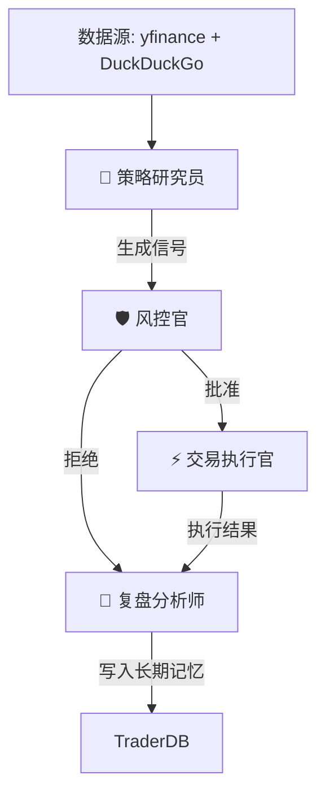

# Quantitative Trader Agent (量化交易智能体系统)


这是一个专业的、基于多智能体协作（Multi-Agent System）的量化交易系统。它不仅仅是一个简单的买卖脚本，而是模拟了一家微型对冲基金的运作架构，将**决策（AI/Logic）**与**执行（Code/Math）**严格解耦。

---

## 🚀 核心架构

本项目基于 **LangGraph** 构建，由四个核心智能体（Agent）组成，它们通过状态图（State Graph）进行协作：



1.  **🧠 策略研究员 (Strategist Agent)**
    *   **职责**：负责寻找 Alpha（超额收益）。
    *   **能力**：结合**技术面**（RSI, MACD, 均线，由 `pandas_ta` 计算）和**基本面**（通过 DuckDuckGo 搜索实时新闻并进行情绪分析）。
    *   **输出**：买入/卖出/持有信号。

2.  **🛡️ 风控官 (Risk Manager Agent)**
    *   **职责**：守住底线，拥有一票否决权。
    *   **逻辑**：即使策略师建议买入，如果 RSI 过高（>80）或触发生存概率检测，风控官会强制拦截交易。它还会查阅“长期记忆”，避免重复犯错。

3.  **⚡ 交易执行官 (Execution Agent)**
    *   **职责**：执行交易。
    *   **逻辑**：负责记录订单，模拟滑点（Slippage），并将交易落库。

4.  **📝 复盘分析师 (Critic Agent)**
    *   **职责**：归因分析与记忆强化。
    *   **逻辑**：无论交易成功还是被拒，它都会生成一段“反思（Reflection）”，存入 `TraderDB`。这些反思会成为未来的决策依据。

---

## 🛠️ 技术栈与数据金库

### 1. 混合数据库架构 (The Vault)
为了兼顾**海量行情分析**与**高频事务处理**，我们采用了双数据库设计：

*   **MarketDB (基于 DuckDB)**
    *   **用途**：存储 OHLCV（开高低收量）行情数据。
    *   **特点**：列式存储，极速查询分析，适合处理数百万行 K 线数据。
*   **TraderDB (基于 SQLite + SQLAlchemy)**
    *   **用途**：存储交易日志（Trades）、持仓（Positions）和智能体记忆（Reflections）。
    *   **特点**：轻量级，支持事务，易于管理。

### 2. 真实数据源
*   **行情**：接入 `yfinance`，获取美股实时数据。
*   **新闻**：接入 `duckduckgo_search`，实时检索全球财经新闻。

---

## ⚡ 快速开始

### 1. 环境准备
确保你安装了 Python 3.10 或更高版本。

```bash
# 克隆仓库
git clone https://github.com/your-username/quantitative-agent.git
cd quantitative-agent

# 创建虚拟环境 (推荐)
python -m venv venv
source venv/bin/activate  # Windows: venv\Scripts\activate

# 安装依赖
pip install -r requirements.txt
```

### 2. 运行实盘循环
本项目设计为模块化运行。直接运行主入口，它会启动一个针对 `AAPL` (苹果公司) 的完整交易决策循环：

```bash
python -m src.main
```

### 3. 预期输出
你将看到控制台输出智能体之间的完整对话：

```text
========== 实盘交易循环: AAPL ==========
[系统] 正在连接数据金库 (The Vault)...
[系统] 正在获取 AAPL 的市场数据...
[市场] AAPL 价格: $259.96
[系统] 正在扫描 AAPL 的新闻线...
...
--- [策略研究员] 技术面: RSI=30.82 | 消息面情绪: 0.00 ---
--- [策略研究员] 生成信号: BUY (超卖 (RSI 30.82) 且情绪尚可) ---
--- [风控官] 决策: 批准 (风控通过) ---
--- [交易执行官] 交易已记录: BUY @ 259.96 ---
...
```

---

## 📂 项目结构

```text
src/
├── agents.py       # 四大核心智能体的逻辑实现
├── database.py     # 数据库层 (DuckDB + SQLite)
├── graph.py        # LangGraph 状态图定义
├── main.py         # 程序主入口
├── market_data.py  # yfinance 数据加载器
├── news.py         # 新闻搜索工具
├── state.py        # 共享状态定义 (TypedDict)
├── tools.py        # 硬核计算工具 (pandas_ta)
└── tests.py        # 单元测试
```

---

## ⚠️ 免责声明 (Disclaimer)

本项目仅供**学习与研究使用**。
1.  **非投资建议**：本系统生成的任何信号都不构成投资建议。
2.  **模拟交易**：默认配置下，本系统仅进行**模拟交易**（Paper Trading），不会连接真实券商账户，也不会使用真实资金。
3.  **风险自负**：量化交易存在极高风险，开发者不对任何因使用本项目而导致的资金损失负责。

---

**Made with ❤️ by Python & AI**
